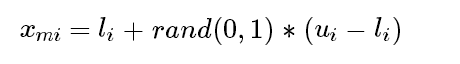
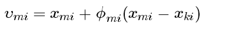
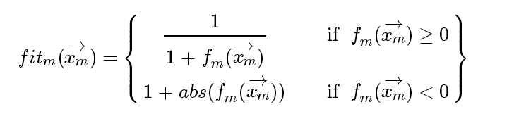
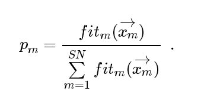
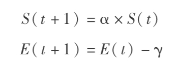
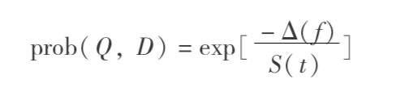

## 人工蜂群算法

### 1、概述

人工蜂群算法(Artifical Bee Colony, ABC) 是学者 Karaboga 于 2005 年提出的，该算法可以用来求解全局优化问题。也就是找到 ` x = {x1, x2, ..., xn} `，使目标函数 f(x) 最小。因此，为了应用 ABC，待求解的问题必须首先转化为最优化问题。

ABC 算法是基于蜜蜂**采蜜行为**的蜂群算法，属于蜂群算法的一个分支（另一个分支是基于蜜蜂**繁殖行为**的蜂群算法）。

除了 ABC，基于蜜蜂采蜜行为的蜂群算法还有：虚拟蜜蜂算法、蜂群优化算法、自适应混沌量子蜜蜂算法、蜜蜂群优化算法、蜜蜂算法、蜜蜂采蜜算法及蜜蜂选巢算法等等，读者可以自行扩展阅读。

### 2、算法基础

人工蜂群由三种蜜蜂组成，雇佣蜂、观察蜂和侦查蜂。算法的最终目的，就是找到花蜜最多的蜜源——这和实际蜜蜂采蜜行为的目的一致。

整个蜂群的目标是寻找花蜜量最大的蜜源。在 ABC 算法中，雇佣蜂利用先前的蜜源信息寻找新的蜜源并与观察蜂分享蜜源信息；观察蜂在蜂房中等待并依据雇佣蜂分享的信息寻找新的蜜源；侦查蜂的任务是寻找一个新的有价值的蜜源，它们在蜂房附近随机地寻找蜜源。

执行算法之前，需要将采蜜行为进行**数学定义**：

假设解空间是 D 维的，雇佣蜂和观察蜂的个数均为 SN，蜜源个数也是 SN，蜜源和雇佣蜂一一对应且蜜源表示最优化问题的一个可能的解。根据 ABC 算法，蜜源会不断的迭代更新，最大迭代数为(MCN)，直到迭代结束或者终止条件成立，得出结果。而如果蜜源多次更新没有改进，雇佣蜂就放弃该蜜源，并转为侦查蜂随机搜索新蜜源。

### 3、算法流程

#### 初始化

初始化所有的蜜源向量 xm，m=1,2...SN，初始化公式为：



其中，xmi 为第 m 只雇佣蜂在第 i 维的初始值，ui 和 li 分别为 xm 的最大最小边界值。

### 雇佣蜂阶段

雇佣蜂在已有的食物源 xm 附近继续寻找新的蜜源 vm，寻找的算法如下：


其中 xk 是另一个随机选取的蜜源，ϕ是个介于[-a,a]的随机数。选出新的蜜源之后，计算该蜜源的适应度，利用 greedy selection 在新旧蜜源之间进行选择。

适应度计算公式为：



其中，fm 是解向量 Xm 的目标函数，适应度函数由目标函数变换而成。

### 观察蜂阶段

观察蜂会随机的选择雇佣蜂对应的蜜源，观察蜂选择某个蜜源的概率 P 为:



观察蜂选取好蜜源之后，再确定个相邻的蜜源 vm，并计算适应度。正如在雇佣蜂阶段所述，使用greedy selection 在新旧蜜源之间进行选择。从而，更多的观察蜂被招募进来，并且有了更好的正反馈。

### 侦查蜂阶段

如果雇佣蜂对应的蜜源质量不好，该蜜源就要被放弃。放弃的规则是，当任一蜜源的收益度经过 limit 次搜索后仍沒有改善，则放弃此蜜源。此时，雇佣蜂变成侦查蜂，重新寻找蜜源。寻找的方法是使用初始化公式随机生成。由于上一轮找到的质量不好的蜜源要被放弃，这就形成了负反馈，与正反馈平衡。

### 栗子

``` cpp
#include<iostream>
#include<time.h>
#include<stdlib.h>
#include<cmath>
#include<fstream>
#include<iomanip>
using namespace std;

const int NP=40;//种群的规模，采蜜蜂+观察蜂
const int FoodNumber=NP/2;//食物的数量，为采蜜蜂的数量
const int limit=20;//限度，超过这个限度没有更新采蜜蜂变成侦查蜂
const int maxCycle=10000;//停止条件

/*****函数的特定参数*****/
const int D=2;//函数的参数个数
const double lb=-100;//函数的下界 
const double ub=100;//函数的上界

double result[maxCycle]={0};

```

``` cpp

/*****种群的定义****/
struct BeeGroup
{
	double code[D];//函数的维数
	double trueFit;//记录真实的最小值
	double fitness;
	double rfitness;//相对适应值比例
	int trail;//表示实验的次数，用于与limit作比较
}Bee[FoodNumber];

BeeGroup NectarSource[FoodNumber];//蜜源，注意：一切的修改都是针对蜜源而言的
BeeGroup EmployedBee[FoodNumber];//采蜜蜂
BeeGroup OnLooker[FoodNumber];//观察蜂
BeeGroup BestSource;//记录最好蜜源

/*****函数的声明*****/
double random(double, double);//产生区间上的随机数
void initilize();//初始化参数
double calculationTruefit(BeeGroup);//计算真实的函数值
double calculationFitness(double);//计算适应值
void CalculateProbabilities();//计算轮盘赌的概率
void evalueSource();//评价蜜源
void sendEmployedBees();
void sendOnlookerBees();
void sendScoutBees();
void MemorizeBestSource();


/*******主函数*******/
int main()
{
	ofstream output;
	output.open("dataABC.txt");

	srand((unsigned)time(NULL));
	initilize();//初始化
	MemorizeBestSource();//保存最好的蜜源
		
	//主要的循环
	int gen=0;
	while(gen<maxCycle)
	{
		sendEmployedBees();
			
		CalculateProbabilities();
			
		sendOnlookerBees();
			
		MemorizeBestSource();
			
		sendScoutBees();
			
		MemorizeBestSource();

		output<<setprecision(30)<<BestSource.trueFit<<endl;
			
		gen++;
	}
	
	output.close();
	cout<<"运行结束!!"<<endl;
	return 0;
}

/*****函数的实现****/
double random(double start, double end)//随机产生区间内的随机数
{	
	return start+(end-start)*rand()/(RAND_MAX + 1.0);
}

void initilize()//初始化参数
{
	int i,j;
	for (i=0;i<FoodNumber;i++)
	{
		for (j=0;j<D;j++)
		{
			NectarSource[i].code[j]=random(lb,ub);
			EmployedBee[i].code[j]=NectarSource[i].code[j];
			OnLooker[i].code[j]=NectarSource[i].code[j];
			BestSource.code[j]=NectarSource[0].code[j];
		}
		/****蜜源的初始化*****/
		NectarSource[i].trueFit=calculationTruefit(NectarSource[i]);
		NectarSource[i].fitness=calculationFitness(NectarSource[i].trueFit);
		NectarSource[i].rfitness=0;
		NectarSource[i].trail=0;
		/****采蜜蜂的初始化*****/
		EmployedBee[i].trueFit=NectarSource[i].trueFit;
		EmployedBee[i].fitness=NectarSource[i].fitness;
		EmployedBee[i].rfitness=NectarSource[i].rfitness;
		EmployedBee[i].trail=NectarSource[i].trail;
		/****观察蜂的初始化****/
		OnLooker[i].trueFit=NectarSource[i].trueFit;
		OnLooker[i].fitness=NectarSource[i].fitness;
		OnLooker[i].rfitness=NectarSource[i].rfitness;
		OnLooker[i].trail=NectarSource[i].trail;
	}
	/*****最优蜜源的初始化*****/
	BestSource.trueFit=NectarSource[0].trueFit;
	BestSource.fitness=NectarSource[0].fitness;
	BestSource.rfitness=NectarSource[0].rfitness;
	BestSource.trail=NectarSource[0].trail;
}

double calculationTruefit(BeeGroup bee)//计算真实的函数值
{
	double truefit=0;
	/******测试函数1******/
	truefit=0.5+(sin(sqrt(bee.code[0]*bee.code[0]+bee.code[1]*bee.code[1]))*sin(sqrt(bee.code[0]*bee.code[0]+bee.code[1]*bee.code[1]))-0.5)
		/((1+0.001*(bee.code[0]*bee.code[0]+bee.code[1]*bee.code[1]))*(1+0.001*(bee.code[0]*bee.code[0]+bee.code[1]*bee.code[1])));

	return truefit;
}

double calculationFitness(double truefit)//计算适应值
{
	double fitnessResult=0;
	if (truefit>=0)
	{
		fitnessResult=1/(truefit+1);
	}else
	{
		fitnessResult=1+abs(truefit);
	}
	return fitnessResult;
}

void sendEmployedBees()//修改采蜜蜂的函数
{
	int i,j,k;
	int param2change;//需要改变的维数
	double Rij;//[-1,1]之间的随机数
	for (i=0;i<FoodNumber;i++)
	{
		
		param2change=(int)random(0,D);//随机选取需要改变的维数

		/******选取不等于i的k********/
		while (1)
		{
			k=(int)random(0,FoodNumber);
			if (k!=i)
			{
				break;
			}
		}

		for (j=0;j<D;j++)
		{
			EmployedBee[i].code[j]=NectarSource[i].code[j];
		}

		/*******采蜜蜂去更新信息*******/
		Rij=random(-1,1);
		EmployedBee[i].code[param2change]=NectarSource[i].code[param2change]+Rij*(NectarSource[i].code[param2change]-NectarSource[k].code[param2change]);
		/*******判断是否越界********/
		if (EmployedBee[i].code[param2change]>ub)
		{
			EmployedBee[i].code[param2change]=ub;
		}
		if (EmployedBee[i].code[param2change]<lb)
		{
			EmployedBee[i].code[param2change]=lb;
		}
		EmployedBee[i].trueFit=calculationTruefit(EmployedBee[i]);
		EmployedBee[i].fitness=calculationFitness(EmployedBee[i].trueFit);

		/******贪婪选择策略*******/
 		if (EmployedBee[i].trueFit<NectarSource[i].trueFit)
 		{
 			for (j=0;j<D;j++)
 			{
 				NectarSource[i].code[j]=EmployedBee[i].code[j];
 			}
			NectarSource[i].trail=0;
			NectarSource[i].trueFit=EmployedBee[i].trueFit;
			NectarSource[i].fitness=EmployedBee[i].fitness;
 		}else
		{
			NectarSource[i].trail++;
		}
	}
}

void CalculateProbabilities()//计算轮盘赌的选择概率
{
	int i;
	double maxfit;
	maxfit=NectarSource[0].fitness;
	for (i=1;i<FoodNumber;i++)
	{
		if (NectarSource[i].fitness>maxfit)
			maxfit=NectarSource[i].fitness;
	}
	
	for (i=0;i<FoodNumber;i++)
	{
		NectarSource[i].rfitness=(0.9*(NectarSource[i].fitness/maxfit))+0.1;
    }
}

void sendOnlookerBees()//采蜜蜂与观察蜂交流信息，观察蜂更改信息
{
	int i,j,t,k;
	double R_choosed;//被选中的概率
	int param2change;//需要被改变的维数
	double Rij;//[-1,1]之间的随机数
	i=0;
	t=0;
	while(t<FoodNumber)
	{
		
        R_choosed=random(0,1);
        if(R_choosed<NectarSource[i].rfitness)//根据被选择的概率选择
        {        
			t++;
			param2change=(int)random(0,D);
			
			/******选取不等于i的k********/
			while (1)
			{
				k=(int)random(0,FoodNumber);
				if (k!=i)
				{
					break;
				}
			}

			for(j=0;j<D;j++)
			{
				OnLooker[i].code[j]=NectarSource[i].code[j];
			}
			
			/****更新******/
			Rij=random(-1,1);
			OnLooker[i].code[param2change]=NectarSource[i].code[param2change]+Rij*(NectarSource[i].code[param2change]-NectarSource[k].code[param2change]);
			
			/*******判断是否越界*******/
			if (OnLooker[i].code[param2change]<lb)
			{
				OnLooker[i].code[param2change]=lb;
			}
			if (OnLooker[i].code[param2change]>ub)
			{	
				OnLooker[i].code[param2change]=ub;
			}
			OnLooker[i].trueFit=calculationTruefit(OnLooker[i]);
			OnLooker[i].fitness=calculationFitness(OnLooker[i].trueFit);
			
			/****贪婪选择策略******/
			if (OnLooker[i].trueFit<NectarSource[i].trueFit)
			{
				for (j=0;j<D;j++)
				{
					NectarSource[i].code[j]=OnLooker[i].code[j];
				}
				NectarSource[i].trail=0;
				NectarSource[i].trueFit=OnLooker[i].trueFit;
				NectarSource[i].fitness=OnLooker[i].fitness;
			}else
			{
				NectarSource[i].trail++;
			}
        } 
        i++;
        if (i==FoodNumber)
		{
			i=0;
		}
	}
}


/*******只有一只侦查蜂**********/
void sendScoutBees()//判断是否有侦查蜂的出现，有则重新生成蜜源
{
	int maxtrialindex,i,j;
	double R;//[0,1]之间的随机数
	maxtrialindex=0;
	for (i=1;i<FoodNumber;i++)
	{
		if (NectarSource[i].trail>NectarSource[maxtrialindex].trail)
		{
			maxtrialindex=i;
		}
	}
	if(NectarSource[maxtrialindex].trail>=limit)
	{
		/*******重新初始化*********/
		for (j=0;j<D;j++)
		{
			R=random(0,1);
			NectarSource[maxtrialindex].code[j]=lb+R*(ub-lb);
		}
		NectarSource[maxtrialindex].trail=0;
		NectarSource[maxtrialindex].trueFit=calculationTruefit(NectarSource[maxtrialindex]);
		NectarSource[maxtrialindex].fitness=calculationFitness(NectarSource[maxtrialindex].trueFit);
	}
}

void MemorizeBestSource()//保存最优的蜜源
{
	int i,j;
	for (i=1;i<FoodNumber;i++)
	{
		if (NectarSource[i].trueFit<BestSource.trueFit)
		{
			for (j=0;j<D;j++)
			{
				BestSource.code[j]=NectarSource[i].code[j];
			}
			BestSource.trueFit=NectarSource[i].trueFit;
		}
	}
}
```

## 蜂群交配优化算法

### 概述

蜂群的交配飞行可被视为是一系列**状态间的改变**:
在此过程中，蜂王以一定的速度在不同状态间转变，并以一定的概率在每一状态下与雄蜂进行交配。 交配飞行之初，蜂王具有一定的飞行速度和能量。在每次状态改变后，蜂王的速度和能量都会有所衰退，衰退方程为：



其中: α∈[0， 1]，γ是状态间改变后能量的衰退值。当蜂王的速度和能量衰减到一定的阈值范围内时，它便飞回蜂巢。

在每一状态下，雄蜂以下面的概率与蜂王进行交配:



其中:prob(Q，D)是雄蜂 D 将其精子成功加入蜂王 Q 的受精囊中的概率，即一次成功交配的概率; Δ(f) 是雄蜂与蜂王匹配值的绝对差，即 f(D) 与 f(Q) 的绝对差; S(t) 表示时刻 t 时蜂王的飞行速度。显然，在交配飞行之初，蜂王的飞行速度高，或者雄蜂与蜂王的**匹配较好**时，成功交配的概率就高。

### 算法流程

#### 步骤 1
随机初始化一个蜂群，蜂群中适应度值最大的个体为蜂王，其余的为雄蜂。

这里的适应度函数根据具体问题具体定义。例如对于某些分类问题，可以是分类算法在验证集上正确分类概率。

#### 步骤2(婚飞)
初始化蜂王的能量和速度，判断受精囊是否满或者蜂王的能量是否达到预先设定的临界值，如果是，则转入步骤 3；否则随机选择一个雄蜂，根据 prob(Q, D) 式计算它的交配概率 pi，如果 pi > r，则交配成功，将它的染色体加入受精囊 S 中。按衰退方程更新蜂王的速度和能量。

#### 步骤3(繁殖过程) 
从受精囊中随机选择一个染色体与蜂王的染色体交叉，产生幼蜂。
这里，染色体/基因的具体指代，也要视具体问题而定。以随机森林算法为例的话，染色体就是一个随机森林，而基因则为一棵决策树。染色体交叉也就指代决策树的交换。

#### 步骤4(饲养过程)
工蜂代表不同的启发式算法，利用工蜂进一步提高幼蜂的性能。

#### 步骤5 
如果适应度最大的幼蜂优于蜂王，则将其替代蜂王，否则蜂王不变，其余幼蜂为雄蜂。

#### 步骤6 
判断是否达到最大婚飞次数，如果达到，则停止，否则转至步骤2。