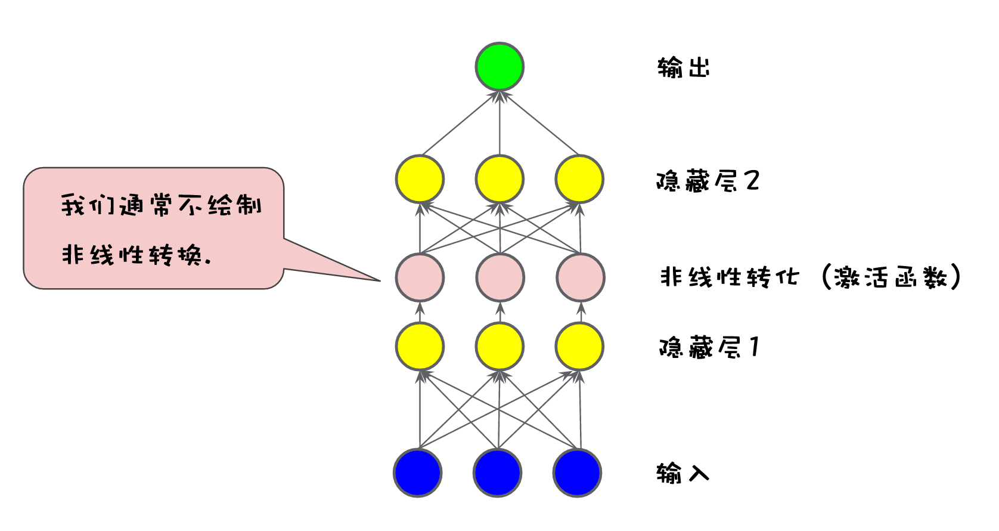

# 机器学习

[机器学习速成课](https://developers.google.com/machine-learning/crash-course/)

下面是部分划重点:

## 1、术语解释

### 回归与分类：

**回归模型可预测连续值**：回归模型做出的预测可回答如下问题：

房产的价值是多少？某件事情发生的概率是多少？

**分类模型可预测离散值**：分类模型做出的预测可回答如下问题：

某个指定电子邮件是垃圾邮件还是非垃圾邮件？
这是一张狗、猫还是仓鼠图片？

### 损失

损失是一个数值，表示对于单个样本而言模型预测的准确程度。
如果模型的预测完全准确，则损失为零，否则损失会较大。

损失是对糟糕预测的惩罚。>.<

**一种常见的损失函数：平方损失**

```
the square of the difference between the label and the prediction
  = (observation - prediction(x))2
  = (y - y')2
```

### 批量

批量指的是用于在单次迭代中样本总数。批量可以指整个数据集，但是实际上，批量大小越大，出现冗余的可能性就越高。

### 泛化 Generalization

泛化是指模型拟合以前未见过的新数据（与创建该模型的数据同分布）的能力。

### 过拟合

过拟合模型在训练过程中产生的损失很低，但在预测新数据方面的表现却非常糟糕。
过拟合是由于模型的复杂程度超出所需程度而造成的。机器学习的基本冲突是适当拟合我们的数据，但也要尽可能简单地拟合数据。

### 精确率和召回率

精确率：在被识别为正类别的样本中，确实为正类别的比例。
召回率：在所有正类别样本中，被正确识别为正类别的比例。
这两个值是此消彼长的。

## 2、如何降低预测的损失

### 梯度下降法

梯度(grad)：梯度是一个矢量，详情可见[一本自由的百科](https://zh.wikipedia.org/wiki/梯度)

梯度公式：


梯度的物理意义是，**指明了函数上升或者下降最快的方向**。

利用梯度这个性质，我们可以逐步找到损失函数的（局部）最小值点。

### 学习速率

首先再次强调，梯度是矢量，它具有方向和大小。
梯度下降法算法：用梯度乘以一个称为学习速率（有时也称为步长）的标量，以确定下一个点的位置。以一个形如 y = kx + b 的函数为例，如果梯度大小为 2.5（一维矢量），学习速率为 0.01，则梯度下降法算法会选择距离前一个点 0.025 的位置作为下一个点。

学习速率如果太小，收敛速度将会极慢；但是如果太大，下一个点将永远在 U 形曲线的底部随意弹跳，也就是，步长太大，直接跨过了最小值点。

### 随机梯度下降法

随机梯度下降法 (SGD) 每次迭代只使用一个样本（批量大小为 1）。如果进行足够的迭代，SGD 也可以发挥作用，但过程会非常杂乱。“随机”这一术语表示构成各个批量的一个样本都是随机选择的。

小批量随机梯度下降法（小批量 SGD）是介于全批量迭代（批量大小为整个数据集）与 SGD 之间的折衷方案。小批量通常包含 10-1000 个随机选择的样本。小批量 SGD 可以减少 SGD 中的杂乱样本数量，但仍然比全批量更高效。

## 3、正则化：简单化

我们可以通过**降低复杂模型的复杂度**来防止过拟合，这种原则称为正则化。

正则化要求，并非只是以最小化损失（经验风险最小化）为目标，而是要最小化损失和复杂度为目标：
<math xmlns="http://www.w3.org/1998/Math/MathML" display="block">
  <mtext>minimize(Loss(Data|Model) + complexity(Model))</mtext>
</math>

###  L2 正则化

 L2 正则化公式可以用来量化模型的复杂度，该公式将正则化项定义为所有特征权重的平方和。

### Lambda

模型开发者通过以下方式来调整正则化项的整体影响：用正则化项的值乘以名为 &#x03BB; （lambda 又称为正则化率）的标量。也就是说，模型开发者会执行以下运算：

<math xmlns="http://www.w3.org/1998/Math/MathML" display="block">
  <mtext>minimize(Loss(Data|Model)</mtext>
  <mo>+</mo>
  <mi>&#x03BB;<!-- λ --></mi>
  <mtext>&#xA0;complexity(Model))</mtext>
</math>

在选择 lambda 值时，目标是在简单化和训练数据拟合之间达到适当的平衡：

如果您的 lambda 值过高，则模型会非常简单，但是您将面临数据欠拟合的风险。您的模型将无法从训练数据中获得足够的信息来做出有用的预测。

如果您的 lambda 值过低，则模型会比较复杂，并且您将面临数据过拟合的风险。您的模型将因获得过多训练数据特点方面的信息而无法泛化到新数据。

## 4、正则化：稀疏性

### 稀疏性正则化 (Regularization for Sparsity)：L₁ 正则化：

L2 和 L1 采用不同的方式降低权重：

L2 会降低权重的平方。
L1 会降低 |权重|。

结果就是，L1 可以使得权重降为 0，L2 通常不会使权重变为 0。

## 5、神经网络

神经网络图例：



## 6、TensorFlow

TensorFlow是一个可用于构建机器学习模型的平台。但其实它的用途范围要广泛得多: 它是一种基于图表的通用计算框架，可用来编写您能想出的任何东西。

一个栗子：
以下是在 tf.estimator 中实现的线性回归程序的格式：

``` python
import tensorflow as tf

# Set up a linear classifier.
classifier = tf.estimator.LinearClassifier()

# Train the model on some example data.
classifier.train(input_fn=train_input_fn, steps=2000)

# Use it to predict.
predictions = classifier.predict(input_fn=predict_input_fn)
```

值得一提，tf.estimator 与 scikit-learn API 兼容。 scikit-learn 是极其热门的 Python 开放源代码机器学习库，拥有超过 10 万名用户，其中包括许多 Google 员工。


